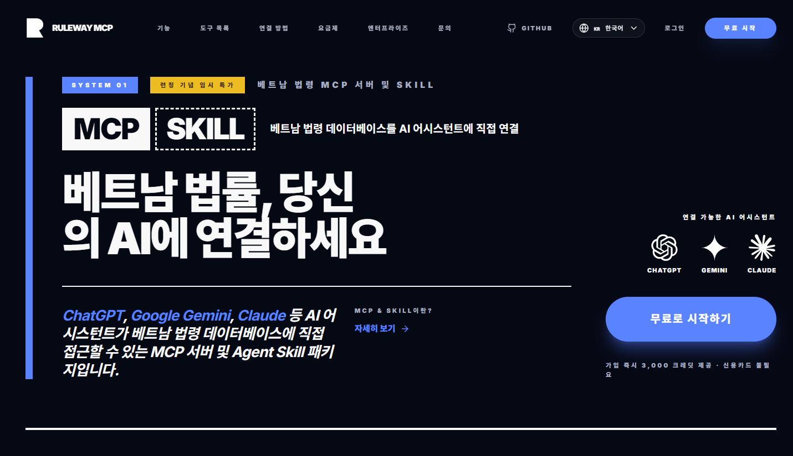

# 🇻🇳 RuleWay — 베트남 법령 MCP 서버

**언어 선택:** 한국어 | [English](README.en.md) | [日本語](README.ja.md) | [Tiếng Việt](README.vi.md)

---

> AI 어시스턴트가 베트남 법령 데이터베이스에 직접 접근할 수 있는 MCP 서버입니다.  
> Claude, Cursor, Gemini CLI, ChatGPT Desktop 등에 연결해 베트남 법령을 자연어로 질의하세요.



🌐 **서비스:** [ruleway.ai/ko/mcp](https://ruleway.ai/ko/mcp)  
🔑 **API 키 발급:** [대시보드 →](https://ruleway.ai/ko/mcp/dashboard)  
🏠 **홈페이지:** [ruleway.ai](https://ruleway.ai)

**65,000+ 베트남 법령 · 실시간 업데이트 · 어느 언어로든 질문 가능**

---

## 왜 MCP / Skill인가?

ChatGPT, Gemini, Claude는 강력한 AI 도구이지만, 베트남 법률 업무에는 결정적으로 하나가 빠져 있습니다. 실제 법령 데이터베이스와의 직접 연결이 없다는 점입니다.

| | 일반 AI | RuleWay MCP / Skill 사용 시 |
|---|---|---|
| **환각 (Hallucination)** | 법령 번호를 지어내고 틀린 조문을 자신있게 답변 | 실제 DB에서 조회한 법령 텍스트만 제공 — 환각 없음 |
| **최신 개정 반영** | 모델 재학습 전까지 새로 제·개정된 법령이 보이지 않음 | 실시간 법령 DB에 직접 쿼리 — 최신 개정 즉시 반영 |
| **출처 검증** | 인용한 출처가 실제로 존재하는지 확인 불가 | 모든 인용 법령을 원문에서 즉시 검증 가능 |
| **베트남 법령 커버리지** | 베트남 특화 데이터 부족으로 추측성 답변 빈번 | 65,000+ 베트남 법령 전용 DB로 정확한 근거 제공 |

---

## 이런 분께 필요합니다

- **베트남 관련 업무를 하는 모든 분** — 계약서 검토, 비자 규정, 세금 문의 등 일상 언어로 AI에게 질문하세요. 법률 전문가가 아니어도 됩니다.
- **베트남 진출을 준비하는 기업** — 진출 전 투자·노동·세무 관련 규정을 신속하게 파악하세요.
- **외국계 기업 법무·컴플라이언스 담당자** — 베트남 법령의 최신 변경 사항과 개정 이력을 즉시 확인하세요.
- **법무법인·회계법인 리서치 담당자** — 법령 번호와 조문 근거를 빠르게 찾아 업무 시간을 절감하세요.
- **HR·세무·계약 담당자** — 업무 맥락 안에서 바로 노동법·세법·계약 규정을 확인하세요.

---

## 주요 기능

| 기능 | 설명 |
|------|------|
| **의미 기반 AI 법령 검색** | 법령 번호 없이 자연어로 질문하면 벡터 유사도로 핵심 조문을 탐색합니다. 단순 키워드 매칭보다 훨씬 정확하고 경제적입니다. |
| **법령 즉시 조회** | 법령 코드로 전문·시행일·유효 여부를 즉시 확인합니다 |
| **개정·대체 법령 추적** | 특정 법령이 이후 어떻게 바뀌었는지, 어느 법령이 대체했는지 자동으로 역추적합니다 |
| **기간·기관별 탐색** | 기간, 부처, 상태(현행·폐지·예정)로 법령 목록을 필터링합니다 |
| **다국어 질의** | 한국어·영어·일본어·베트남어 등 어느 언어로 질문해도 AI가 처리합니다 |
| **실시간 데이터** | 베트남 정부 공식 법령 포털(phapluat.gov.vn) 기준으로 지속적으로 업데이트됩니다 |

### 지원 문서 유형

베트남 입법 체계의 모든 법령 문서 유형을 커버합니다:

`헌법` · `법전/코덱스` · `법률` · `법령(Pháp lệnh)` · `명령` · `결의` · `공동결의` · `시행령(Nghị định)` · `결정(Quyết định)` · `통달(Thông tư)` · `공동통달` · `통합본`

---

## 제공 도구 (8가지)

| 도구 이름 | 설명 |
|-----------|------|
| ⭐ `search_regulation_chunks_by_vector` | 법령 본문 조문 청크를 임베딩 기반 유사도로 검색 (핵심 기능). 키워드 매칭이 아닌 의미 유사도 검색. |
| `find_regulation_by_code` | 법령 코드로 전문 및 메타데이터를 즉시 조회 |
| `search_regulations` | 베트남어 법령명 키워드로 부분 일치 검색 |
| `find_regulations_referencing_code` | 특정 법령을 인용·개정·대체한 법령 역추적 |
| `find_related_regulations` | `related_decrees` 필드를 통한 연관 법령 일괄 조회 |
| `list_regulations` | 날짜·분야·기관·상태 조건으로 법령 목록 탐색 |
| `get_field_of_law_codes` | 법 분야 코드 목록 조회 (63개 분야, 다국어 표시) |
| `get_master_codes` | 법령 체계 레벨 및 발령 기관 코드 조회 |

> **참고:** Claude Extended Thinking, ChatGPT o1/o3, Gemini Deep Research 등 고급 추론 모드는 정확도 향상을 위해 여러 도구를 반복 호출할 수 있습니다.

---

## 빠른 설치 (권장)

> 🔑 **먼저 API 키를 발급하세요:** [ruleway.ai/ko/mcp](https://ruleway.ai/ko/mcp) 에서 가입 후 [대시보드](https://ruleway.ai/ko/mcp/dashboard)에서 무료로 발급할 수 있습니다.

JSON을 직접 수정하지 않아도 되는 CLI 설치 도구:

```bash
npx vietnamese-legal-mcp
```

API 키와 사용할 AI 툴을 입력하면 설정 파일이 자동으로 작성됩니다.

```bash
# 비대화식 설치
npx vietnamese-legal-mcp --key rwmcp_YOUR_KEY --tool cursor
```

**지원 툴:** Cursor · Claude Desktop · Windsurf · Codex · Antigravity · Gemini CLI

---

## 연결 방법 (수동 설정)

### 1단계: 가입 및 API 키 발급

1. [ruleway.ai/ko/mcp](https://ruleway.ai/ko/mcp) 에서 회원가입
2. [대시보드](https://ruleway.ai/ko/mcp/dashboard) → API 키 발급

---

### Claude.ai 웹

**Settings → Integrations → Add MCP Server** 에 아래 URL 입력:

```
https://mcp.ruleway.ai/sse?api_key=YOUR_API_KEY
```

> ⚠️ URL에 API 키가 포함됩니다. 타인과 공유하거나 공개된 곳에 게시하지 마세요. 키를 자주 재발급하는 것을 권장합니다.

---

### 데스크톱 & CLI (Claude Desktop · Cursor · Gemini CLI · Windsurf · Antigravity)

> **사전 준비:** [Node.js](https://nodejs.org/) 설치 필요 (npx 실행을 위해)

설정 파일에 아래 JSON을 붙여넣고 `YOUR_API_KEY`를 실제 키로 교체하세요.

**Mac / Linux:**
```json
{
  "mcpServers": {
    "vietnamese-legal": {
      "command": "npx",
      "args": [
        "-y", "mcp-remote",
        "https://mcp.ruleway.ai/sse",
        "--header", "x-api-key:YOUR_API_KEY"
      ]
    }
  }
}
```

**Windows:**
```json
{
  "mcpServers": {
    "vietnamese-legal": {
      "command": "cmd",
      "args": [
        "/c", "npx", "-y", "mcp-remote",
        "https://mcp.ruleway.ai/sse",
        "--header", "x-api-key:YOUR_API_KEY"
      ]
    }
  }
}
```

**설정 파일 위치:**

| 툴 | 설정 파일 |
|----|-----------|
| Cursor (전역) | `~/.cursor/mcp.json` |
| Cursor (프로젝트) | `.cursor/mcp.json` |
| Claude Desktop (Mac) | `~/Library/Application Support/Claude/claude_desktop_config.json` |
| Claude Desktop (Win) | `%APPDATA%\Claude\claude_desktop_config.json` |
| Gemini CLI | `~/.gemini/settings.json` |
| Windsurf | `~/.codeium/windsurf/mcp_config.json` |
| Antigravity | `~/.gemini/antigravity/mcp_config.json` |

저장 후 앱을 재시작하면 적용됩니다.

---

### Agent Skill 패키지

MCP 대신 AI 에이전트 스킬 방식을 선호한다면 `vietnamese-legal-skill`을 사용하세요.  
MCP와 동일한 8가지 법령 검색 도구를 제공하며, 취향에 따라 선택할 수 있습니다.

```bash
npx vietnamese-legal-skill
```

**지원 AI 도구 및 설치 경로**

| AI 도구 | 설치 경로 |
|---------|----------|
| Cursor | `~/.cursor/skills/vietnamese-legal/` |
| Claude (Desktop) | `~/.claude/skills/vietnamese-legal/` |
| Codex | `~/.agents/skills/vietnamese-legal/` |
| Antigravity | `~/.gemini/antigravity/skills/vietnamese-legal/` |

`--tool` 플래그로 비대화식 실행 가능:

```bash
npx vietnamese-legal-skill --tool cursor --key rwmcp_your_key_here
```

---


## 사용 예시

```
🇰🇷 한국 법무팀
질문: 베트남 자회사 설립 시 외국인 지분 한도가 있나요?
답변: 법률 67/2014/QH13 제22조 — 업종별 외국인 투자 한도 및 예외 사항...
      출처: [67/2014/QH13](https://phapluat.gov.vn/...)
```

```
🇯🇵 일본 HR 담당자
질문: 베트남 노동법상 연차는 며칠인가요?
답변: 노동법전 제113조 — 1년 근속 기준 최소 12일, 유해·위험 업무는 14일...
```

```
🇺🇸 미국 컴플라이언스
질문: Is Circular 22/2025/TT-NHNN currently in effect?
답변: Yes. Circular 22/2025/TT-NHNN issued by the State Bank of Vietnam is currently in effect as of...
```

```
🇯🇵 일본계 제조사
질문: 環境影響評価の手続きはどこに規定されていますか？
답변: Nghị định 08/2022/NĐ-CP 第18条 — 環境影響評価の手続きについては...
```

```
🇬🇧 영국 로펌
질문: Which decree governs corporate income tax for foreign companies?
답변: The primary regulation is Circular 78/2014/TT-BTC and its amendments. Key articles: Article 10...
```

---

## 자주 묻는 질문 (FAQ)

**Q: 베트남어를 몰라도 사용할 수 있나요?**  
A: 네. AI가 한국어·영어·일본어 등 어느 언어로든 자동 처리합니다.

**Q: 어떤 AI 툴에 연결할 수 있나요?**  
A: MCP 방식: ChatGPT, Google Gemini, Claude, Cursor, Windsurf, Antigravity, Gemini CLI  
Skill 패키지: Cursor, Codex, Antigravity 등 커스텀 스킬을 지원하는 AI 에이전트

**Q: 법령 데이터는 얼마나 최신인가요?**  
A: 베트남 정부 공식 법령 포털([phapluat.gov.vn](https://phapluat.gov.vn)) 기준으로 지속 업데이트됩니다. 최신 개정 사항이 실시간으로 반영됩니다.

**Q: 인용된 출처를 직접 확인할 수 있나요?**  
A: 네. 모든 답변에 원본 법령 코드와 phapluat.gov.vn 출처 링크가 포함됩니다.

**Q: AI 검색 결과가 법률 전문가 자문을 대체할 수 있나요?**  
A: 아닙니다. 결과는 참고용이며 법률 전문가의 조언을 대체하지 않습니다. 중요한 법률 문제는 반드시 변호사와 상담하세요.

---

## 비즈니스 제안

RuleWay는 **Legal 버티컬 AI** 기능 확장을 위해 법률 전문 기관·로펌·법무 테크 파트너와의 협업을 기다리고 있습니다.

- **도메인 데이터·전문 지식 결합** — 판례, 계약, 실무 워크플로 데이터를 AI와 통합해 Legal AI 품질을 높입니다
- **MCP·Skill 기반 공동 설계·검증** — Legal AI 기능을 함께 설계하고 파일럿을 진행합니다
- **공동 GTM·화이트라벨·API 연동** — 다양한 협업 모델을 유연하게 논의할 수 있습니다

법률 전문 회사·기관의 제안을 환영합니다. 📧 [제안하기](https://forms.gle/hDXonrupAWTSNAN28)

> 제출 시 문의 유형에서 「제안」을 선택해 주세요.

---

## 엔터프라이즈

더 깊은 통합이 필요하신가요? → **[엔터프라이즈 문의](https://ruleway.ai/intro/enterprise)**

- **엔터프라이즈 배포** — On-Premise/사설망 로컬 LLM, SSO·부서별 접근 제어, 사내 규정 AI 검색, 커스텀 리포트 및 자동화 워크플로우
- **REST API 서비스** — 베트남 법령 DB에 REST API로 직접 접근, 의미 기반 벡터 검색, 다국어 Q&A 엔진 통합

📧 [문의하기](https://forms.gle/hDXonrupAWTSNAN28)

---

## 보안 안내

- API 키는 URL에 포함될 수 있습니다. URL을 타인과 공유하거나 공개된 곳에 게시하지 마세요.
- [대시보드](https://ruleway.ai/ko/mcp/dashboard)에서 키를 자주 재발급하는 것을 권장합니다.
- 키 노출로 인한 피해에 대해 RuleWay는 책임을 지지 않습니다.

---

## 문의

📧 [문의하기](https://forms.gle/hDXonrupAWTSNAN28)  
🌐 [ruleway.ai](https://ruleway.ai)
